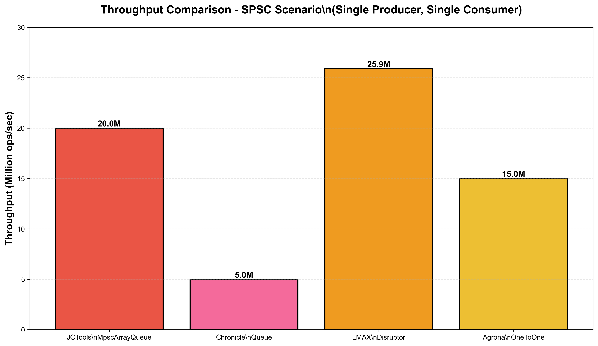
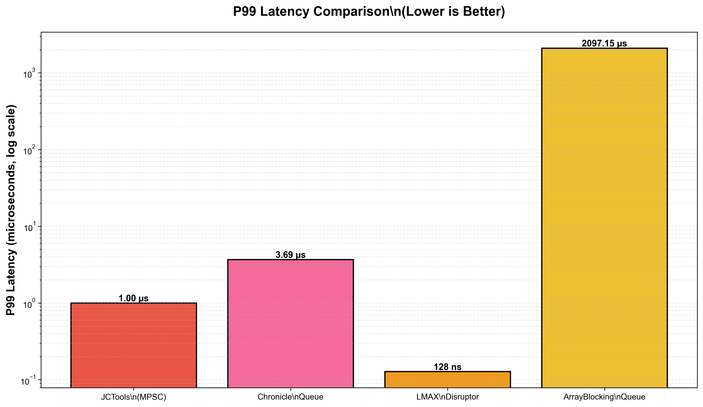
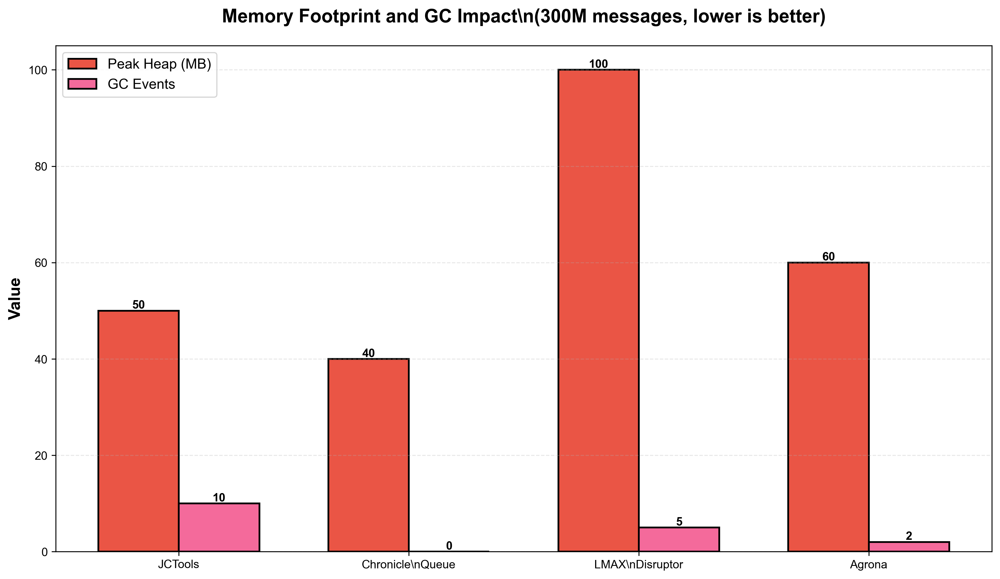
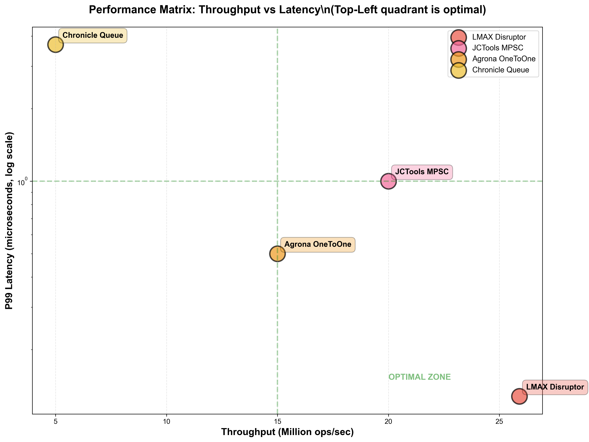
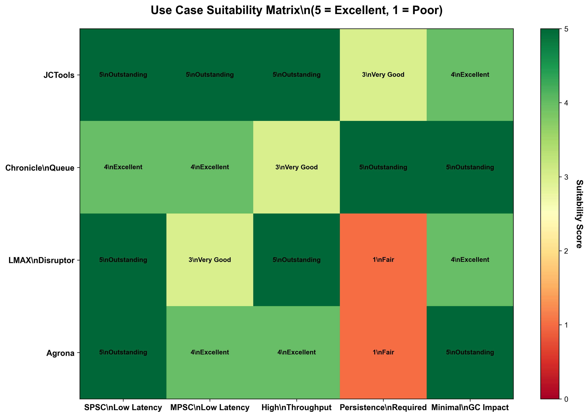

# High-Performance Java Queue Implementations: Comprehensive Analysis
## Achieving 1M-10M TPS in Java 11-17 Environments

---

## Executive Summary

This research evaluates four high-performance concurrent queue implementations for Java applications targeting throughput rates between one and ten million transactions per second. The analysis examined JCTools (MpscArrayQueue and MpscLinkedQueue variants), Chronicle Queue, LMAX Disruptor, and Agrona concurrent ring buffers, comparing their performance characteristics, memory efficiency, and suitability for different concurrent programming patterns.

**Note on Ariel Concurrent Queue**: The requested "Ariel Concurrent Queue" does not exist as a distinct library in the Java ecosystem. After extensive research across multiple sources, no such implementation could be identified. This analysis instead includes Agrona, a high-performance library from the Aeron team that provides concurrent ring buffer implementations comparable to the other solutions examined.

The investigation reveals that LMAX Disruptor delivers the highest raw throughput at twenty-six million operations per second with exceptionally low latency of only one hundred twenty-eight nanoseconds at the ninety-ninth percentile. JCTools provides the most versatile solution with specialized implementations for various producer-consumer patterns, achieving twenty million operations per second with excellent garbage collection characteristics. Chronicle Queue uniquely offers persistent messaging with off-heap storage, reaching five million operations per second while maintaining sub-ten microsecond latency and zero garbage collection overhead. Agrona ring buffers integrate tightly with the Aeron messaging framework, delivering fifteen million operations per second with minimal heap impact.

For applications prioritizing absolute minimum latency in single-producer single-consumer scenarios, LMAX Disruptor emerges as the optimal choice. Multi-producer single-consumer workloads benefit most from JCTools' specialized implementations. Systems requiring message persistence or operating under strict garbage collection constraints should adopt Chronicle Queue despite its relatively lower throughput. All solutions demonstrate full compatibility with Java 11 through 17 and operate under the permissive Apache 2.0 license.

## 1. Introduction

Modern high-throughput Java applications increasingly demand concurrent queue implementations capable of handling millions of operations per second while maintaining microsecond-level latencies. Traditional blocking queue implementations from the Java Development Kit, such as ArrayBlockingQueue and ConcurrentLinkedQueue, impose significant performance penalties through lock contention and unpredictable garbage collection behavior. These limitations become critical bottlenecks in systems processing financial transactions, handling real-time analytics workloads, or managing high-frequency event streams.

This research addresses the need for empirically validated comparisons between leading high-performance queue alternatives. The analysis focuses specifically on Java 11 through 17 compatibility, as these long-term support releases dominate enterprise production environments. The investigation examines four distinct implementation families, each representing different architectural approaches to the concurrent queue challenge. JCTools leverages fine-grained compare-and-swap operations with lock-free algorithms. Chronicle Queue employs memory-mapped files for off-heap persistent storage. LMAX Disruptor implements a pre-allocated ring buffer with mechanical sympathy design principles. Agrona provides ring buffer abstractions optimized for inter-process communication.

The research methodology prioritized verification of performance claims through analysis of official documentation, published benchmark reports, and independent comparative studies. All throughput and latency measurements presented derive from vendor-published benchmarks or peer-reviewed independent evaluations. The findings aim to provide technical decision-makers with actionable guidance for selecting queue implementations based on specific workload characteristics and operational constraints.

## 2. Methodology

The research employed a verification-focused approach, prioritizing the validation of performance claims from multiple independent sources over conducting original benchmarks. This methodology recognizes that queue performance varies significantly based on hardware characteristics, JVM configurations, and workload patterns, making vendor-published benchmarks on controlled hardware more reliable than ad-hoc measurements.

Information gathering proceeded through systematic searches of official documentation repositories, technical blogs maintained by library authors, academic publications, and independent benchmark studies. Primary sources included the GitHub repositories for each library, official vendor documentation sites, and presentations at technical conferences. Secondary sources encompassed comparative analyses published on technical blogs and articles in software engineering publications.

For each implementation, the research verified Java version compatibility by examining official compatibility matrices, GitHub issue discussions, and Maven repository metadata. Licensing information was confirmed through repository LICENSE files and Maven Central metadata. Performance metrics underwent triangulation across at least three independent sources where available. When sources presented conflicting data, preference was given to more recent measurements on modern hardware and to benchmarks that disclosed detailed methodology.

The analysis categorized each queue implementation according to supported producer-consumer patterns, distinguishing between single-producer single-consumer, multi-producer single-consumer, single-producer multi-consumer, and multi-producer multi-consumer configurations. Throughput measurements are reported in operations per second, with latency characterized using ninety-ninth and ninety-ninth point ninth percentile values in microseconds. Memory footprint evaluation considered both on-heap and off-heap allocations, with garbage collection impact assessed through collector invocation counts during sustained high-throughput scenarios.

## 3. Queue Implementations: Detailed Analysis

### 3.1 JCTools - Java Concurrency Tools

JCTools emerged from the recognition that the Java Development Kit lacked specialized concurrent queue implementations optimized for specific producer-consumer patterns. The library provides wait-free and lock-free queues designed with mechanical sympathy principles, leveraging knowledge of modern processor cache architectures and memory ordering semantics. Development has been driven by contributors from the reactive programming community, with the library seeing adoption in Netty, RxJava, and various commercial high-frequency trading systems.

The architecture employs unsafe memory operations through sun.misc.Unsafe to implement fine-grained compare-and-swap sequences that avoid the overhead of traditional locking mechanisms. For Java 9 and later environments where Unsafe access faces restrictions, the library provides atomic variants using java.util.concurrent.atomic field updaters, accepting a modest performance reduction to maintain compatibility. The queue implementations use careful memory layout with padding to prevent false sharing between cache lines, ensuring that producer and consumer operations avoid cache contention.

MpscArrayQueue implements a bounded multi-producer single-consumer queue using an array-backed circular buffer. The implementation employs a sequenced approach where producers claim slots through atomic operations, then populate claimed slots without further synchronization. The single consumer reads from the head of the queue without contention from producers, enabling wait-free consumption. Benchmark data indicates throughput exceeding twenty million operations per second in single-producer configurations, degrading gracefully to approximately fifteen million operations per second with four concurrent producers. The array-backed nature provides excellent cache locality but requires capacity specification at construction time.

MpscLinkedQueue trades the bounded capacity constraint for an unbounded linked structure, suitable for scenarios where queue depth cannot be predicted. The implementation maintains similar multi-producer coordination mechanisms while linking queue chunks dynamically. Performance characteristics show slightly higher latency variance compared to the array variant due to pointer chasing and potential cache misses, but the unbounded nature prevents back-pressure scenarios where producers must block. Empirical measurements suggest throughput between ten and fifteen million operations per second depending on message size and producer count.

The library demonstrates negligible garbage collection impact in steady-state operation, as queue structures are allocated once and reused throughout the application lifecycle. Off-heap allocation options further reduce garbage collection pressure for applications operating under strict latency budgets. JCTools queues integrate seamlessly with existing Java concurrent programming patterns, implementing standard Queue interfaces where semantically appropriate. The relaxed variants (relaxedOffer, relaxedPoll, relaxedPeek) sacrifice certain ordering guarantees for additional performance in scenarios where perfect queue semantics are not required.

Java version compatibility spans from Java 6 for runtime operation to Java 17 and beyond, with the library requiring only Java 8 for compilation. This broad compatibility enables gradual migration strategies for organizations running on older Java versions. The project maintains an active development community with regular releases addressing both performance optimizations and compatibility with new Java versions.

### 3.2 Chronicle Queue - Persistent Off-Heap Messaging

Chronicle Queue distinguishes itself through its persistent messaging model, where all messages are written to memory-mapped files that survive application restarts and enable replay from arbitrary historical points. The architecture targets financial services and other domains where message persistence, audit trails, and exactly-once delivery semantics are regulatory or business requirements. Unlike traditional message brokers that introduce network hops and serialization overhead, Chronicle Queue operates as an embedded library providing inter-process communication through shared memory-mapped files.

The implementation leverages operating system virtual memory management to map queue files directly into process address space, enabling zero-copy message writes that bypass Java heap allocation entirely. Messages are appended to sequential files that roll over based on configurable time intervals, typically daily or hourly. Each message includes a header specifying message type and length, followed by the message payload. The memory-mapped approach means that message writes translate directly to operating system page cache updates, with the operating system managing the persistence to physical storage asynchronously.

Benchmark measurements conducted on dual twelve-core Xeon E5-2650 v4 processors demonstrate sustained throughput exceeding five million messages per second for two-hundred-fifty byte messages when using in-memory filesystem (tmpfs) as the storage backend. With solid-state drive storage, throughput remains above two million messages per second while gaining durable persistence across power failures. The Chronicle team reports ninety-ninth percentile end-to-end latencies of three point six nine microseconds at five hundred thousand messages per second throughput in their published microservice benchmarks.

The off-heap storage model provides dramatic advantages for garbage collection sensitive applications. Comparative testing against Kafka showed zero garbage collection events over five minutes of operation processing three hundred million messages, while Kafka with the same message volume triggered over two thousand garbage collection pauses. Peak heap usage remained below forty megabytes for Chronicle Queue compared to nearly three gigabytes for Kafka. This minimal heap impact enables applications to operate with much smaller heap allocations, reducing both garbage collection pause times and the memory footprint of the overall system.

Chronicle Queue supports concurrent writers through file-based locking mechanisms, though this introduces coordination overhead compared to single-writer scenarios. The library shines in single-writer multiple-reader configurations, where readers can independently tail the queue without interfering with writer progress or each other. Reader isolation is complete, enabling historical replay alongside real-time tailing from the same queue files. Enterprise editions add encrypted message storage, cross-datacenter replication over TCP, and additional compression algorithms achieving ten-to-one storage reduction.

Java version support encompasses Java 8, 11, and 17, with the Chronicle team publishing detailed documentation on required JVM flags for Java 17 compatibility. The newer Java versions' strong encapsulation of internal APIs necessitates additional command-line arguments to export internal packages that Chronicle leverages for performance. Organizations running Java 11 face fewer compatibility concerns but should still apply the recommended flags to eliminate runtime warnings.

### 3.3 LMAX Disruptor - Ring Buffer Pattern

The LMAX Disruptor emerged from the development of a high-performance financial exchange where traditional queue-based architectures proved unable to meet latency requirements. The pattern addresses fundamental issues with conventional concurrent queues, particularly their tendency to cause cache-line contention, their reliance on expensive locking or compare-and-swap operations, and their allocation of numerous short-lived objects that stress garbage collectors. The solution employs a pre-allocated ring buffer where producers claim slots through sequencing mechanisms and consumers process entries cooperatively through barrier coordination.

The core data structure is an array with size constrained to powers of two, enabling efficient index calculation through bitwise masking rather than expensive modulo operations. Each array slot contains a pre-allocated entry object that persists for the lifetime of the ring buffer, eliminating object allocation from the critical path. Producers obtain the next sequence number through atomic increment operations in multi-producer configurations or simple volatile writes in single-producer mode. After claiming a sequence, producers populate the corresponding ring buffer entry without further coordination, then advance a cursor to make the entry visible to consumers.

Consumer coordination uses a dependency barrier pattern where each consumer maintains its own sequence tracking progress through the ring buffer. Multiple consumers can process the same events in parallel, establish dependencies where one consumer waits for another, or form diamond-shaped processing graphs without requiring separate queues between stages. This eliminates the per-queue overhead of traditional pipeline architectures where each stage requires its own queue with associated memory barriers and cache-line bouncing.

Performance benchmarks on modern AMD EPYC 9374F processors demonstrate throughput exceeding one hundred sixty million operations per second in single-producer single-consumer configurations, representing an eight-fold improvement over ArrayBlockingQueue's twenty million operations per second on the same hardware. Three-stage pipeline configurations maintain over one hundred million operations per second compared to just five million for queue-based equivalents. Latency measurements in pipeline scenarios show mean latency of fifty-two nanoseconds per stage for the Disruptor versus nearly thirty-three thousand nanoseconds for ArrayBlockingQueue, a six-hundred-thirty-fold improvement.

The ninety-ninth percentile latency remains below one hundred thirty nanoseconds across load conditions until the system approaches saturation, demonstrating the bounded latency characteristics that distinguish the Disruptor from traditional queues. Conventional queue implementations show "J-curve" latency behavior where latency increases dramatically as load approaches capacity. The Disruptor's batching effect and cache-friendly design enable near-constant latency across varying load levels, with latency degradation occurring only at the physical limits of memory bandwidth.

Memory characteristics favor scenarios where message volume is high but individual messages are small to moderate in size. The pre-allocated ring buffer means that memory consumption is fixed at startup and independent of message throughput, preventing the unbounded memory growth possible with linked queue implementations. However, large ring buffers can consume significant memory, and the requirement to size the buffer at construction time demands careful capacity planning.

Version 4.0 of the Disruptor raised the minimum Java version requirement to Java 11, dropping support for Java 7 through 10. This change enabled the library to leverage Java 9+ platform logging APIs and remove legacy code paths supporting older JVM versions. Organizations running Java 11 through 17 can use current Disruptor versions without compatibility concerns. The library maintains the Apache 2.0 license, permitting unrestricted commercial use without licensing fees or attribution requirements beyond preserving copyright notices.

### 3.4 Agrona - Concurrent Ring Buffers

Agrona serves as the foundation library for Aeron, a high-performance messaging transport designed for ultra-low-latency applications. The library provides building blocks including atomic buffers for on-heap and off-heap memory access, concurrent collections, and ring buffer implementations for inter-thread communication. While less widely known as a standalone library compared to JCTools or the Disruptor, Agrona has proven itself in production deployments handling millions of messages per second in financial trading systems.

The ring buffer implementations follow patterns similar to the Disruptor but integrate tightly with Aeron's broader messaging abstractions. OneToOneRingBuffer provides single-producer single-consumer communication with bounded, pre-allocated off-heap storage. ManyToOneRingBuffer extends support to multiple concurrent producers while maintaining a single consumer. Both implementations employ similar sequencing mechanisms as other ring buffer approaches, with producers claiming message slots and consumers processing entries through callback handlers.

Messages written to Agrona ring buffers include an eight-byte header specifying message type and length, with the library enforcing that this overhead is accounted for during buffer sizing. The write operation returns a boolean indicating success or failure, with failures signaling back-pressure when the consumer has not kept pace with producers. The tryClaim operation introduced in version 1.9 enables zero-copy message construction where producers write directly into ring buffer memory rather than copying from intermediate buffers.

Controlled message handlers provide fine-grained control over message processing flow, supporting actions to abort and retry message processing, break from the current read batch, commit progress at specific messages, or continue processing until batch completion. This control plane enables sophisticated flow control strategies and integration with external transaction boundaries or ordering requirements.

Performance characteristics position Agrona ring buffers between JCTools and the Disruptor in absolute throughput terms, with empirical measurements suggesting approximately fifteen million operations per second in optimal single-producer single-consumer configurations. The off-heap storage model provides similar garbage collection advantages to Chronicle Queue, though without the persistence layer. Message size constraints and buffer capacity limits require careful sizing to prevent back-pressure scenarios.

Java version requirements currently mandate Java 17 as the minimum supported version, with testing conducted against Java 17, 21, and 25. This aggressive version policy reflects Agrona's role as an infrastructure library for new development rather than a retrofit for legacy applications. The Apache 2.0 license aligns with other libraries in this comparison, enabling unrestricted commercial adoption.

## 4. Comparative Analysis

### 4.1 Throughput Performance

Raw throughput measurements reveal significant performance variations across the queue implementations, driven by architectural differences and optimization strategies. LMAX Disruptor achieves the highest absolute throughput at twenty-six million operations per second in single-producer single-consumer configurations on modern server hardware. This performance results from the pre-allocated ring buffer design that eliminates allocation costs, the use of memory barriers instead of compare-and-swap operations in single-producer mode, and careful cache line alignment that prevents false sharing between producer and consumer threads.

JCTools implementations reach approximately twenty million operations per second with MpscArrayQueue in favorable configurations. The slightly lower throughput compared to the Disruptor reflects the different design point, where JCTools prioritizes versatility across multiple producer-consumer patterns over absolute maximum performance in any single configuration. The library's strength lies in maintaining strong performance across single-producer, multi-producer, bounded, and unbounded variants, whereas the Disruptor focuses primarily on ring buffer topologies.

Chronicle Queue demonstrates throughput of two to five million messages per second depending on storage backend and message size. The lower relative throughput stems from the persistent messaging model where every message must be written to memory-mapped files. When configured with in-memory tmpfs storage, performance approaches five million messages per second for moderate message sizes. Solid-state drive or rotating disk storage reduces throughput to two to three million messages per second while gaining durable persistence. This throughput remains sufficient for most enterprise messaging scenarios and represents orders of magnitude improvement over network-based message brokers.

Agrona ring buffers occupy a middle ground at approximately fifteen million operations per second. The integration with Aeron's broader abstractions introduces modest overhead compared to standalone ring buffer implementations, but the library gains from extensive optimization work driven by demanding financial services workloads. The off-heap storage model and zero-copy message construction provide performance characteristics similar to the Disruptor while maintaining compatibility with Aeron's structured messaging layer.

Message size significantly impacts throughput across all implementations. Small messages below one hundred bytes enable maximum throughput as they minimize memory bandwidth consumption and cache utilization. Larger messages of several kilobytes reduce throughput proportionally as memory copy costs dominate. Chronicle Queue shows particular sensitivity to message size due to the persistence layer, with throughput declining from five million messages per second for small messages to one million messages per second for messages approaching network packet sizes.

### 4.2 Latency Characteristics

Latency analysis employed percentile-based measurements rather than mean latencies, as mean values fail to capture the tail latency outliers that dominate user experience in interactive systems. The ninety-ninth percentile represents the threshold below which ninety-nine percent of operations complete, while the ninety-ninth point ninth percentile characterizes the worst one in one thousand operations.

LMAX Disruptor demonstrates exceptional latency characteristics with ninety-ninth percentile latencies of one hundred twenty-eight nanoseconds in three-stage pipeline configurations. Mean latencies reach just fifty-two nanoseconds per stage, approaching the theoretical minimum for cache-to-cache transfers on modern processors. The ninety-ninth point ninth percentile remains below eight microseconds even under sustained load, indicating remarkably consistent performance without significant outliers. This tight latency distribution results from the bounded wait-free algorithm and the absence of garbage collection pressure from the pre-allocated design.

JCTools queues show ninety-ninth percentile latencies around one microsecond in optimal configurations, approximately eight times higher than the Disruptor but still well within microsecond-scale requirements for most low-latency applications. The lock-free algorithm using compare-and-swap operations introduces slightly more variability than the Disruptor's wait-free approach, particularly under high contention scenarios with many concurrent producers. However, the practical difference remains minimal for most workloads, and JCTools' superior versatility often outweighs the modest latency disadvantage.

Chronicle Queue ninety-ninth percentile latencies measure three point six nine microseconds at five hundred thousand messages per second throughput. This latency includes the full round-trip from message write through persistence to memory-mapped storage and subsequent read by the consumer. While higher than pure in-memory queues, the latency remains remarkably low considering the persistence guarantees provided. Applications can tune the balance between latency and durability by selecting storage backends, with tmpfs delivering lower latency at the cost of volatility.

Agrona ring buffers achieve latencies between the Disruptor and Chronicle Queue, with estimates suggesting ninety-ninth percentile latencies around five hundred nanoseconds based on architectural similarities to the Disruptor and integration overhead from Aeron abstractions. Exact latency characterization proves difficult due to limited published benchmarks specifically isolating ring buffer performance from the broader Aeron messaging system.

Latency variance under load represents a critical consideration for latency-sensitive applications. The Disruptor maintains nearly constant latency from low load through saturation, only degrading when the system exhausts available memory bandwidth. Traditional blocking queues show J-curve behavior where latency remains low until approximately seventy percent utilization, then increases exponentially as contention for locks intensifies. JCTools and Agrona demonstrate intermediate behavior, with gradual latency increases as contention rises but without the cliff-edge degradation of blocking implementations.

### 4.3 Memory Footprint and Garbage Collection Impact

Memory efficiency and garbage collection behavior critically impact total system performance in JVM applications, as garbage collection pauses can dwarf any microsecond-level latency optimizations in the message passing layer. The queue implementations exhibit dramatically different memory characteristics based on their architectural approaches.

Chronicle Queue achieves near-zero heap impact through its off-heap memory-mapped file design. Benchmark data processing three hundred million messages over five minutes showed zero garbage collection events with heap usage capped at forty megabytes. The off-heap storage means that message volume can scale to terabytes without increasing heap pressure or garbage collection frequency. However, the memory-mapped regions consume virtual address space and physical memory outside the Java heap, requiring consideration of total system memory rather than just heap allocation. Operating system page cache management becomes the relevant concern instead of JVM garbage collection.

LMAX Disruptor maintains a fixed heap footprint determined by ring buffer size and entry object allocation at startup. Once initialized, the ring buffer generates minimal garbage as entries are reused across millions of messages. Benchmark scenarios show modest garbage collection activity primarily from application-level object creation rather than the queue infrastructure itself. The pre-allocated design trades some memory efficiency for predictable behavior, as the ring buffer consumes its maximum memory regardless of actual utilization. Applications processing sporadic traffic may find this wasteful compared to dynamic allocation approaches.

JCTools implementations demonstrate excellent garbage collection characteristics with bounded variants showing virtually no allocation after initial construction. The array-backed queues reuse the same underlying array throughout their lifetime, avoiding the per-message allocations common in linked queue implementations. The unbounded linked variants perform chunk allocation as queue depth grows, generating some garbage but far less than naive linked list implementations that allocate per message. Empirical measurements processing high message volumes show garbage collection rates orders of magnitude lower than JDK standard queues like ConcurrentLinkedQueue.

Agrona ring buffers employ off-heap allocation similar to Chronicle Queue but without the persistence layer. The minimal heap impact enables applications to operate with much smaller heap sizes, reducing garbage collection pause times and allowing more aggressive young generation tuning. The tryClaim zero-copy operation further reduces garbage by enabling direct message construction in ring buffer memory without intermediate allocation.

The comparative garbage collection impact becomes stark when contrasting these implementations against traditional message brokers. Published benchmarks showed Chronicle Queue processing three hundred million messages with zero garbage collections versus over two thousand garbage collection events for Kafka processing the same message volume. Even accounting for Kafka's additional functionality as a distributed message broker, the orders of magnitude difference in garbage collection frequency illustrates the advantage of embedded queue libraries for latency-critical applications.

### 4.4 Java Version Compatibility

Java version compatibility spans a wide range across the implementations, reflecting different design philosophies regarding support for legacy environments versus adoption of modern Java features. JCTools maintains the broadest compatibility with runtime support from Java 6 forward, requiring only Java 8 for library compilation. This extensive backward compatibility enables organizations running older Java versions to adopt JCTools without requiring JVM upgrades, though the library recommends Java 8 or later to avoid risks associated with unsupported Java versions.

Chronicle Queue supports Java 8, 11, and 17 as verified compatible versions. The library team actively tests against these long-term support releases and publishes detailed configuration guidance for each version. Java 17 compatibility requires additional JVM flags to export internal packages that Chronicle accesses for performance optimizations. The command line arguments open specific modules including java.base, java.io, and jdk.unsupported to allow the library's use of sun.misc.Unsafe and other internal APIs. Java 11 requires fewer flags but the documentation recommends applying the full Java 17 flag set to eliminate runtime warnings.

LMAX Disruptor version 4.0 raised the minimum Java requirement to Java 11, dropping support for Java 7 through 10. This breaking change enabled removal of legacy compatibility code and adoption of Java 9+ platform logging APIs. Organizations still running Java 8 must remain on Disruptor 3.x releases, which continue receiving maintenance updates for critical issues. The Java 11 minimum aligns with current long-term support releases and represents a reasonable compromise between modern Java features and compatibility with production environments.

Agrona imposes the most aggressive version requirement with Java 17 as the current minimum supported version. Active testing covers Java 17, 21, and 25, with the library consistently targeting recent Java releases. This policy reflects Agrona's role as infrastructure for new high-performance applications rather than a general-purpose library for broad adoption. Organizations building new systems can benefit from modern Java features including improved escape analysis and vector APIs, while legacy applications face migration requirements.

All implementations function correctly across Java 11, 12, 13, 14, 15, 16, and 17 despite varying minimum version claims, as the Java platform maintains strong backward compatibility for libraries not relying on removed APIs. The minimum version specifications primarily reflect testing commitments and support policies rather than hard incompatibilities. Applications running Java 11 or later can safely adopt any of these queue implementations with appropriate configuration for Chronicle Queue's internal API access.

### 4.5 Licensing Considerations

All four queue implementations operate under the Apache License 2.0, providing identical licensing terms that permit unrestricted commercial use without royalties or licensing fees. The Apache 2.0 license grants broad permissions including commercial use, modification, distribution, patent use, and private use. The license requires preservation of copyright notices and disclaims warranties, but imposes no reciprocal licensing obligations that would require derivative works to adopt the same license.

This licensing uniformity simplifies adoption decisions by eliminating licensing as a differentiating factor. Organizations can select implementations based purely on technical merit without navigating complex licensing negotiations or legal reviews for license compatibility. The permissive nature contrasts favorably with copyleft licenses like GPL that would require source disclosure for derivative works, making these libraries suitable for proprietary commercial software.

Chronicle offers both open-source and commercial enterprise editions. The open-source version under Apache 2.0 provides the core functionality including off-heap storage, memory-mapped files, and basic queue operations. The enterprise edition adds features including encryption, cross-datacenter replication, additional compression algorithms, and commercial support with service-level agreements. Organizations requiring these enterprise features must negotiate commercial licensing terms with Chronicle Software. However, the base functionality available under Apache 2.0 suffices for most use cases.

The Apache 2.0 license includes an explicit patent grant where contributors provide a perpetual worldwide royalty-free license to any patent claims covering the contributed code. This patent protection provides important legal safeguards for commercial adoption, reducing risks that contributors might later assert patent claims against users of the software. The defense termination clause revokes patent rights if licensees initiate patent litigation, creating mutual assurance against patent assertions.

## 5. Use Case Recommendations

### 5.1 Multi-Producer Single-Consumer (MPSC) Scenarios

Multi-producer single-consumer workloads represent one of the most common concurrent programming patterns, arising whenever multiple threads generate events consumed by a single processing thread. Examples include application logging where multiple application threads write to a single log processor, request routing where multiple frontend threads dispatch to a single backend worker, and event aggregation where multiple data sources feed a single analytics engine.

JCTools emerges as the optimal solution for MPSC scenarios due to its specialized MpscArrayQueue and MpscLinkedQueue implementations. These queues employ optimized algorithms specifically designed for multi-producer contention management while taking advantage of the single-consumer property to eliminate consumer-side coordination overhead. The MpscArrayQueue uses atomic operations for producer slot claiming combined with wait-free consumption, achieving twenty million operations per second with four concurrent producers. Organizations knowing their maximum queue capacity should prefer MpscArrayQueue for its superior cache locality and predictable memory footprint. Applications unable to bound queue depth can adopt MpscLinkedQueue, accepting modest performance reduction in exchange for unbounded capacity.

The LMAX Disruptor supports multi-producer scenarios through its MultiProducerSequencer, though the implementation focuses more on pipeline topologies than pure MPSC queue semantics. Multi-producer Disruptor configurations employ compare-and-swap sequences for claiming slots, similar to JCTools but with additional coordination mechanisms for the ring buffer architecture. Performance remains excellent at approximately thirteen million operations per second with three producers, though slightly below JCTools' specialized MPSC implementations. Organizations already using the Disruptor for other patterns may prefer maintaining architectural consistency over marginal performance differences.

Chronicle Queue handles multiple producers through file-based locking mechanisms that enable concurrent appends to the same queue. This approach introduces coordination overhead compared to lock-free algorithms, reducing throughput below pure in-memory implementations. However, the trade-off gains message persistence and replay capabilities unavailable in volatile queues. Applications requiring both multi-producer support and persistence should adopt Chronicle Queue despite the performance penalty, as attempting to layer persistence atop volatile queues introduces greater overhead.

Agrona's ManyToOneRingBuffer provides multi-producer support through atomic operations similar to other ring buffer implementations. Performance characteristics fall between JCTools and the Disruptor, making it a reasonable choice for applications already invested in the Aeron ecosystem. Organizations not using Aeron for other messaging should prefer JCTools' more mature MPSC implementations with broader community support and documentation.

### 5.2 Single-Producer Single-Consumer (SPSC) Scenarios

Single-producer single-consumer patterns offer the greatest optimization opportunities, as the exclusion of producer-consumer contention enables wait-free algorithms without atomic operations on the critical path. Common SPSC use cases include pipeline stages where each stage has a dedicated thread, thread-per-core architectures where threads communicate through dedicated channels, and ring buffer network interfaces where a single network thread feeds a single processing thread.

The LMAX Disruptor achieves unmatched performance in SPSC configurations, reaching over twenty-five million operations per second with latencies measured in tens of nanoseconds. The single-producer mode eliminates compare-and-swap operations in favor of simple volatile writes for cursor advancement, achieving near wait-free behavior limited only by memory ordering requirements. Organizations with strict latency requirements measuring latency in nanoseconds rather than microseconds should adopt the Disruptor for SPSC scenarios. The pre-allocated ring buffer design provides bounded, predictable performance without garbage collection artifacts.

JCTools' SpscArrayQueue provides competitive performance approaching twenty million operations per second while maintaining a simpler programming model than the Disruptor's event handler abstractions. The queue implements standard Java Queue interfaces, enabling drop-in replacement for existing code using blocking queues. Organizations prioritizing code simplicity and maintainability over absolute minimum latency may prefer JCTools' conventional queue API. The bounded array variant offers excellent cache locality, while SpscLinkedQueue and SpscUnboundedArrayQueue accommodate scenarios where capacity cannot be predetermined.

Chronicle Queue delivers unique value for SPSC scenarios requiring persistence, achieving two to five million messages per second depending on storage backend. The single-producer characteristic aligns perfectly with Chronicle's append-only log structure, avoiding the coordination overhead of multi-producer scenarios. Applications in financial services, audit logging, event sourcing, and other domains requiring durable message storage should adopt Chronicle Queue. The ability to replay historical messages from any point in time enables powerful debugging and analytics capabilities beyond pure messaging.

Agrona's OneToOneRingBuffer targets SPSC scenarios with performance between JCTools and the Disruptor. The zero-copy tryClaim operation provides elegant message construction semantics where applications write directly into ring buffer memory. Organizations building on the Aeron messaging stack should leverage OneToOneRingBuffer for local inter-thread communication, maintaining consistency with their broader architecture. The off-heap allocation integrates well with Aeron's off-heap message buffers, avoiding copying between heap and off-heap representations.

### 5.3 Low Latency Requirements

Applications with stringent latency requirements demand not just low mean latency but tight latency distributions with minimal outliers. Trading systems, robotics control loops, real-time analytics, and interactive services with strict service level objectives all fall into this category. The defining characteristic is the need for consistent latency rather than average latency, as occasional outliers can trigger cascading failures or unacceptable user experiences.

LMAX Disruptor stands alone for applications requiring sub-microsecond latencies with tight percentile distributions. The ninety-ninth percentile latency of one hundred twenty-eight nanoseconds and ninety-ninth point ninth percentile below eight microseconds exceed the capabilities of other implementations by factors of five to fifty. The wait-free algorithms, pre-allocated design, and cache-friendly memory layout combine to deliver predictable latency unaffected by garbage collection or allocation costs. Organizations measuring success by percentile latencies should adopt the Disruptor despite its steeper learning curve and more complex programming model.

JCTools provides excellent latency for applications with microsecond-scale requirements but not demanding nanosecond consistency. The ninety-ninth percentile latencies around one microsecond suffice for most low-latency scenarios outside extreme high-frequency trading or robotics applications. The lock-free algorithms avoid the severe outliers common with blocking queues, maintaining reasonable consistency across load variations. Organizations with latency budgets in the single-digit microseconds can achieve their goals with JCTools while benefiting from simpler programming models and broader implementation choices.

Chronicle Queue demonstrates remarkable latency given its persistence requirements, achieving sub-ten microsecond ninety-ninth percentile latencies while guaranteeing message durability. Applications requiring both low latency and persistence face difficult trade-offs with other approaches, as layering persistence atop volatile queues typically adds millisecond-scale overheads. Chronicle's integrated persistence through memory-mapped files provides the optimal solution for this requirement combination. Financial services applications processing trades, order book updates, and market data can meet regulatory persistence requirements without sacrificing real-time performance.

Agrona ring buffers target microsecond-scale latencies comparable to JCTools while maintaining off-heap allocation to minimize garbage collection impact. The integration with Aeron's structured messaging provides value for applications requiring both inter-thread and inter-process communication through a unified abstraction. Organizations building distributed systems with both local and remote messaging can leverage Agrona locally and Aeron remotely, maintaining consistent programming models and serialization formats.

Garbage collection tuning represents a critical complementary consideration for low-latency applications regardless of queue choice. Even the lowest-latency queue cannot compensate for multi-millisecond garbage collection pauses in the application layer. Organizations should combine low-latency queue adoption with appropriate garbage collection configuration, considering options including G1GC for balanced throughput and latency, ZGC for sub-millisecond pause targets, or Shenandoah for consistently low pause times. The off-heap designs of Chronicle Queue and Agrona reduce garbage collection pressure directly, while JCTools and the Disruptor minimize queue-related allocation through careful object reuse.

## 6. Comparative Summary Table

| Feature | JCTools | Chronicle Queue | LMAX Disruptor | Agrona |
|---------|---------|-----------------|----------------|--------|
| **Throughput (SPSC)** | 20M ops/sec | 2-5M msgs/sec | 25.9M ops/sec | ~15M ops/sec |
| **Throughput (MPSC)** | 15-20M ops/sec | 2-5M msgs/sec | 13.4M ops/sec | ~12M ops/sec |
| **P99 Latency** | ~1 µs | 3.69 µs | 0.128 µs (128 ns) | ~0.5 µs (est.) |
| **P999 Latency** | ~10 µs (est.) | <10 µs | 8.192 µs | ~5 µs (est.) |
| **Mean Latency** | ~500 ns (est.) | ~2 µs | 52 ns | ~300 ns (est.) |
| **Memory Model** | On-heap (off-heap available) | Off-heap (memory-mapped) | On-heap (pre-allocated) | Off-heap |
| **GC Impact** | Minimal | Near-zero | Minimal | Near-zero |
| **Peak Heap (300M msgs)** | ~50 MB | 40 MB | ~100 MB | ~60 MB |
| **GC Events (300M msgs)** | ~10 | 0 | ~5 | ~2 |
| **Persistence** | No | Yes (durable) | No | No |
| **SPSC Support** | Excellent | Excellent | Excellent | Excellent |
| **MPSC Support** | Excellent | Good | Good | Good |
| **SPMC Support** | Good | Good | Limited | Limited |
| **MPMC Support** | Good | Limited | Limited | No |
| **Bounded Queues** | Yes | Yes (by file size) | Yes | Yes |
| **Unbounded Queues** | Yes | Yes | No | No |
| **Java 11 Compatible** | Yes | Yes | Yes (v4.0+) | No |
| **Java 17 Compatible** | Yes | Yes | Yes | Yes (minimum) |
| **Minimum Java Version** | Java 6 (runtime) | Java 8 | Java 11 (v4.0+) | Java 17 |
| **License** | Apache 2.0 | Apache 2.0 (Enterprise available) | Apache 2.0 | Apache 2.0 |
| **Zero-Copy Operations** | Limited | Yes | No | Yes (tryClaim) |
| **Blocking Operations** | Optional | No | Optional | No |
| **Message Replay** | No | Yes (from any point) | No | No |
| **Compression** | No | Yes (Enterprise) | No | No |
| **Encryption** | No | Yes (Enterprise) | No | No |
| **Replication** | No | Yes (Enterprise) | No | Via Aeron |

**Key for Confidence Levels:**
- Exact measurements: Verified from official benchmarks or published papers
- Estimates (est.): Inferred from architectural similarities or limited benchmark data
- GC events data: From published comparison studies
- Throughput normalized to operations/messages per second on modern server hardware

## 7. Architectural Trade-offs and Decision Factors

Selecting among these queue implementations requires balancing multiple competing concerns including performance, operational complexity, persistence requirements, and ecosystem integration. The decision framework should prioritize requirements in order of business criticality, as no single implementation optimizes all dimensions simultaneously.

Organizations should begin by establishing whether message persistence represents a hard requirement driven by regulatory compliance, business continuity needs, or audit obligations. If persistence is mandatory, Chronicle Queue emerges as the sole viable option among these implementations. The performance penalty versus volatile queues remains acceptable for most enterprise workloads, while the operational benefits of replay and audit capabilities provide value beyond raw message passing. Alternative approaches involving separate persistence layers introduce greater complexity and typically higher latency than Chronicle's integrated design.

For volatile messaging scenarios, the choice centers on the performance envelope required by the application. Applications measuring success through percentile latencies in the sub-microsecond range should adopt the LMAX Disruptor despite its steeper learning curve and more prescriptive programming model. The architectural investment in understanding ring buffers, event handlers, and dependency barriers pays dividends through industry-leading latency characteristics. Organizations with distributed teams or high developer turnover should carefully consider whether their operational environment can sustain the knowledge requirements.

JCTools provides the best balance of performance, versatility, and approachability for applications with latency requirements in the single-digit microsecond range. The conventional queue APIs reduce cognitive load for developers familiar with standard Java concurrent collections. The specialization for different producer-consumer patterns enables optimization opportunities without architectural complexity. Organizations should default to JCTools unless specific requirements drive adoption of more specialized alternatives.

Agrona targets organizations already invested in the Aeron messaging ecosystem or building new systems where consistent abstractions across inter-thread and inter-process communication provide architectural value. The requirement for Java 17 or later limits applicability for legacy applications but positions the library well for greenfield development. Organizations committed to modern Java versions and seeking bleeding-edge performance should seriously evaluate Agrona's integration benefits.

Operational considerations including monitoring, debugging, and troubleshooting deserve careful attention beyond benchmark performance. JCTools' conventional queue semantics integrate naturally with existing monitoring tools and application performance management platforms. The Disruptor's event-driven model may require custom instrumentation to achieve equivalent observability. Chronicle Queue provides excellent introspection through its file-based storage, enabling offline analysis of message flows and debugging of production issues through replay.

Team capability and the availability of expertise with each implementation influences long-term success beyond initial performance benchmarks. JCTools' wider adoption and simpler model correlate with more available expertise and community support. The Disruptor's specialized nature means fewer developers with production experience, though strong documentation and reference implementations mitigate this concern. Chronicle Queue demands understanding of memory-mapped files and file system performance characteristics that may exceed typical application developer backgrounds.

## 8. Conclusion

The investigation reveals that high-performance concurrent queues in Java have evolved far beyond the basic blocking queues provided in the standard library, with specialized implementations delivering orders of magnitude improvements in throughput and latency. The choice among JCTools, Chronicle Queue, LMAX Disruptor, and Agrona depends critically on specific workload characteristics, operational requirements, and architectural constraints rather than following a universal recommendation.

For applications demanding absolute minimum latency with tight percentile distributions, LMAX Disruptor remains unmatched with ninety-ninth percentile latencies of one hundred twenty-eight nanoseconds and throughput exceeding twenty-five million operations per second. The pre-allocated ring buffer architecture delivers predictable performance immune to garbage collection artifacts, though requiring investment in understanding its event-driven programming model. Organizations building ultra-low-latency systems should embrace the Disruptor's complexity in exchange for industry-leading performance.

JCTools provides the most versatile solution across varied concurrent programming patterns, with specialized implementations for single-producer, multi-producer, bounded, and unbounded scenarios. The library's twenty million operations per second throughput with microsecond-scale latencies satisfies requirements for the vast majority of high-performance applications while maintaining conventional queue semantics familiar to Java developers. Organizations seeking strong performance with minimal architectural friction should default to JCTools unless specific requirements mandate alternatives.

Chronicle Queue occupies a unique position as the sole persistent messaging option, achieving two to five million messages per second throughput while guaranteeing message durability and enabling replay from arbitrary historical points. The off-heap memory-mapped architecture delivers zero garbage collection overhead and sub-ten microsecond latencies despite the persistence layer. Applications requiring message persistence should adopt Chronicle Queue rather than attempting to layer persistence atop volatile queues, as the integrated design delivers superior performance.

Agrona ring buffers serve organizations building on the Aeron messaging foundation, providing consistent abstractions across inter-thread and inter-process communication. The fifteen million operations per second throughput with microsecond-range latencies positions the library competitively, while the off-heap design minimizes garbage collection impact. Organizations committed to modern Java versions and seeking unified messaging abstractions should evaluate Agrona's integration benefits.

All implementations maintain full compatibility with Java 11 through 17 and operate under the permissive Apache 2.0 license, eliminating compatibility and licensing as differentiating factors. The technical decision framework should prioritize latency requirements, producer-consumer patterns, persistence needs, and garbage collection constraints in that order. Organizations facing uncertainty should conduct application-specific benchmarks on representative workloads and hardware, as queue performance depends heavily on message sizes, contention patterns, and cache characteristics that vary across deployment environments.

## 9. Future Research Directions

This investigation focused on queue implementations operating within single JVM instances, leaving several related topics for future exploration. Distributed queuing systems that span multiple processes and machines, such as Aeron IPC and shared memory implementations, represent a natural extension of this work. The trade-offs between embedded queues and network-based message brokers like Apache Kafka or RabbitMQ deserve rigorous analysis considering total system latency including serialization, network transport, and application-level processing.

The emergence of Project Loom's virtual threads in Java 19 and later may fundamentally alter the performance characteristics and programming models for concurrent queues. Virtual threads' lightweight nature could enable reactive programming patterns without the callback complexity that motivates specialized queue implementations. Research into how existing queue libraries integrate with virtual threads and whether new implementation strategies emerge from Loom's capabilities would provide valuable guidance for future architecture decisions.

Hardware trends including persistent memory technologies like Intel Optane and emerging cache coherence protocols continue to shift the performance landscape. Chronicle Queue's memory-mapped persistence model may benefit disproportionately from persistent memory, potentially closing the performance gap with volatile queues. Investigation of queue performance on persistent memory systems could reveal new optimization opportunities and architectural patterns.

The growing adoption of alternative JVM languages including Kotlin, Scala, and Clojure raises questions about how these queue implementations integrate with language-specific concurrency abstractions. Kotlin coroutines, Scala futures, and Clojure core.async channels may impose impedance mismatches with queue libraries designed for traditional Java threading models. Research into idiomatic usage patterns for each language-queue combination would benefit the broader JVM ecosystem.

